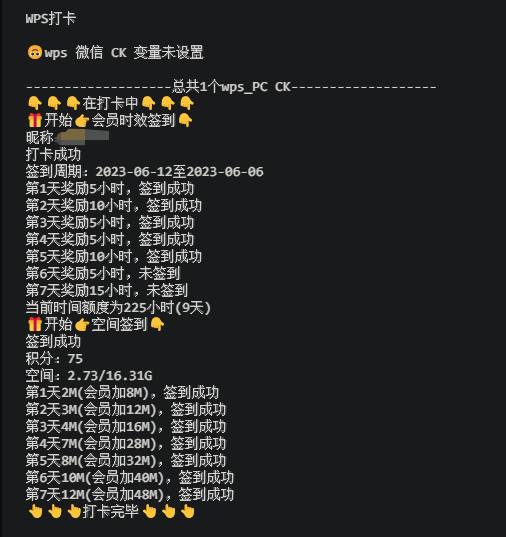

#### 功能
| 名称     | 功能                                                                      | 变量获取                          |
|:-------|:------------------------------------------------------------------------|:------------------------------|
| wps pc | pc端签到领取兑换vip时间<br/>pc端自动兑换vip时间<br/>pc端签到领取空间容量(验证码上还存在点问题)<br/>稻壳PPT签到 | [获取](https://vip.wps.cn/home) |
| wps wx | 微信小程序签到领取会员权益<br/>注:code未解决，有效期只有两小时                                    | 微信小程序                         |
| csdn   | 等待完善                                                                    |                               |
| 联通营业厅  | 等待完善                                                                    |                               |

---
#### 使用
<details> <summary>青龙面板</summary>

##### 拉库
```
ql repo https://github.com/ytt447735/automation.git wps.py fun|notify.py fun main py
```
##### 环境变量
PC(day等于兑换天数，可不设)：
```
wps_pc
wpsua=***;wps_sid=***;day=1
```
微信（暂时不好用，csrftoken有效期只有两小时左右）：
```
wps_wx
csrftoken=***;wps_sid=***
```
</details>

---
#### 预览
<details> <summary>WPS</summary>


</details>