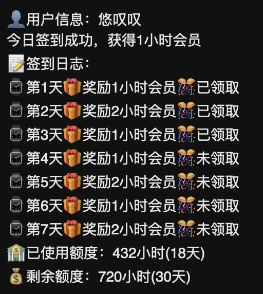

#### 功能
| 名称     | 功能                                                                      | 变量获取                          |
|:-------|:------------------------------------------------------------------------|:------------------------------|
| wps pc | pc端签到领取兑换vip时间<br/>pc端自动兑换vip时 <br/> | [获取](https://vip.wps.cn/home)                                                                   |                               |

---
#### 使用
<details> <summary>青龙面板</summary>

##### 拉库
```
ql repo https://github.com/ytt447735/automation.git wps.py fun|notify.py fun main py
```
##### 环境变量
PC(day等于每日签到时自动兑换天数，可不设)：
```
wps_pc
wpsua=***;wps_sid=***;day=1
```
#### 验证码识别配置
采用的是百度的手写文字识别功能，[获取](https://console.bce.baidu.com/ai/?_=1722298138766#/ai/ocr/overview/index)
在"/fun/baidu.py"文件内修改"API_KEY"、"SECRET_KEY"的值
</details>

---
#### 预览
<details> <summary>WPS</summary>


</details>